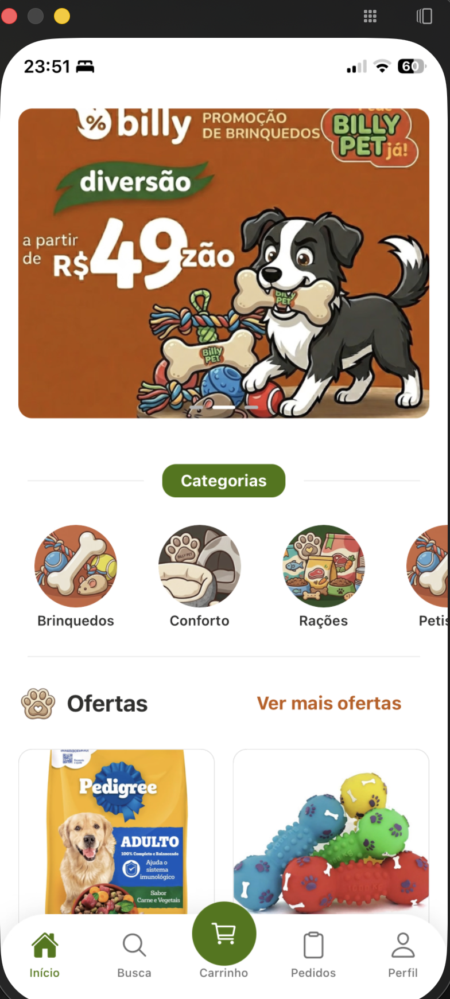
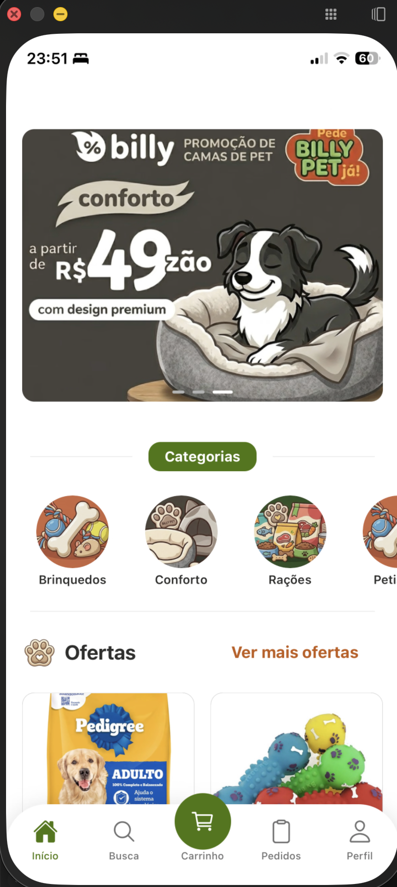
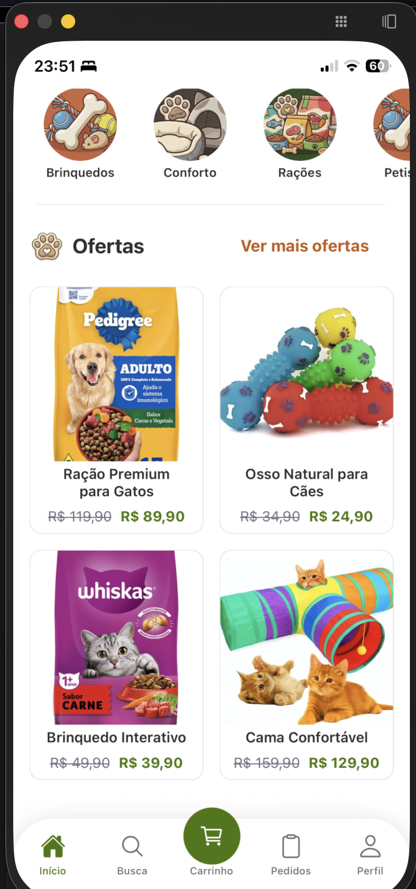
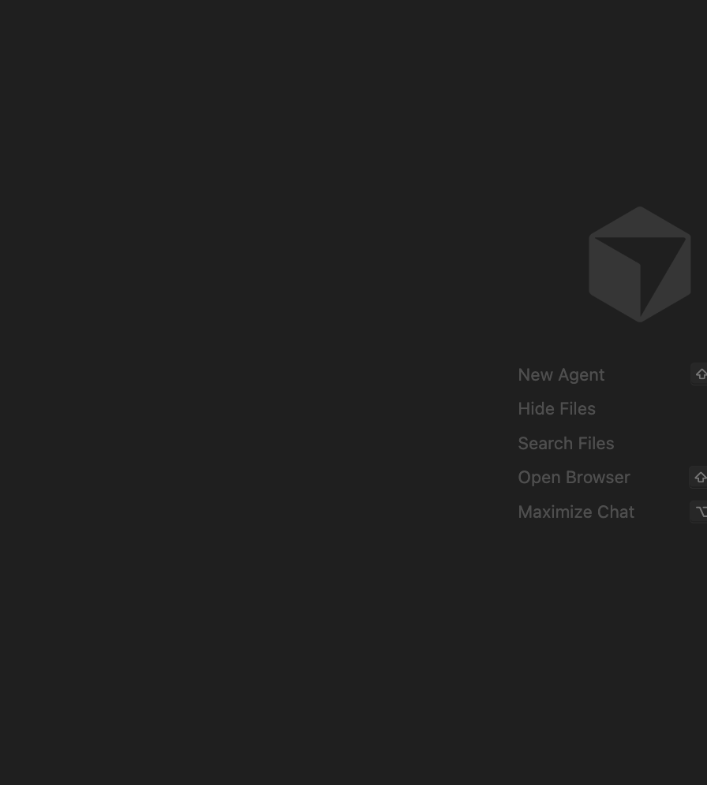

<p align="center"></p>

---

Billy Pet é um aplicativo de pet shop desenvolvido para a Faculdade CESMAC. Projeto mobile com **React Native** e **Expo**, focado na venda de produtos para pets (ração, acessórios, medicamentos, brinquedos, etc.).

## Capturas de tela

| | | |
|:---:|:---:|:---:|
| <p align="center"></p> | <p align="center"></p> | <p align="center"></p> |
| <p align="center"></p> | <p align="center"></p> | <p align="center"></p> |

## Comandos disponíveis

| Arquivo | Resumo |
|---------|--------|
| `architecture.md` | frontend-specialist para criar arquivos, reorganizar, refatorar ou verificar arquitetura |
| `auth-routes.md` | auth-routes-specialist para rotas com autenticação obrigatória, proteção e fluxo de login |
| `code-review.md` | code-review-agent para análise de código, code review e entender o projeto |
| `components.md` | frontend-specialist para criar ou modificar componentes React Native |
| `doc-design-system.md` | design-system-documenter para documentação completa do design system |
| `git-commit.md` | github-specialist para commits Conventional Commits e git push |
| `readme.md` | github-specialist para criar ou atualizar o README do projeto |
| `screen-workflow.md` | frontend-specialist para criar, editar ou remover telas |
| `test.md` | testing-specialist para criar ou debugar testes Jest/Expo |

## Instalação e uso

```bash
# Clonar o repositório (HTTPS)
git clone https://github.com/pedrorcruzz/billy-pet.git

# Ou via SSH
git clone git@github.com:pedrorcruzz/billy-pet.git

# Instalar dependências
npm install

# Iniciar o projeto
npm start

# Plataformas específicas
npm run android   # Android
npm run ios       # iOS
npm run web       # Web
```
